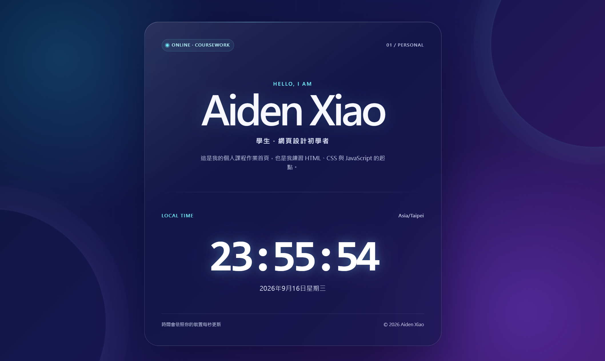

# AIoT-DA 課程 — DIC-1 個人入口網站

> **課程名稱**：AIoT 與數據分析（AIoT & Data Analytics, AIoT-DA） 
> **課堂實作**：DIC-1（Do in Class 1）— 個人入口網站與動態時鐘儀表板（Personal Portal & Live Timekeeper） 
> **作者**：Aiden Xiao 
> **儲存庫網址**：[https://github.com/AidenXiao0924/DIC-1-Personal-Page](https://github.com/AidenXiao0924/DIC-1-Personal-Page) 
> **Live Demo Page**：[https://aidenxiao0924.github.io/DIC-1-Personal-Page/](https://aidenxiao0924.github.io/DIC-1-Personal-Page/)

## 網站畫面

